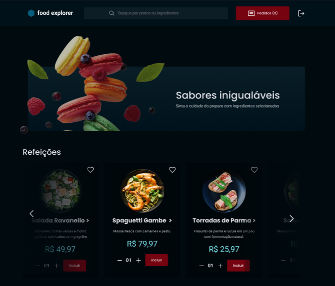

[JAVASCRIPT__BADGE]: https://img.shields.io/badge/Javascript-000?style=for-the-badge&logo=javascript
[TYPESCRIPT__BADGE]: https://img.shields.io/badge/typescript-D4FAFF?style=for-the-badge&logo=typescript
[REACT__BADGE]: https://img.shields.io/badge/React-005CFE?style=for-the-badge&logo=react
[VUE__BADGE]: https://img.shields.io/badge/VueJS-fff?style=for-the-badge&logo=vue
[GATSBY__BADGE]: https://img.shields.io/badge/Gatsby-7026b9?style=for-the-badge&logo=gatsby
[ANGULAR__BADGE]: https://img.shields.io/badge/Angular-red?style=for-the-badge&logo=angular
[PROJECT__BADGE]: https://img.shields.io/badge/📱Visite_este_projeto-000?style=for-the-badge&logo=project
[STYLED__BADGE]: https://img.shields.io/badge/Styledcomponents-ffffff?style=for-the-badge&logo=styledcomponents

<h1 align="center" style="font-weight: bold;">🍚 Food Explorer 🍚</h1>

![react][REACT__BADGE]
![javascript][JAVASCRIPT__BADGE]
![styled][STYLED__BADGE]


<p align="center">
 <a href="#about">Sobre</a> • 
 <a href="#started">Decolando</a> • 
  <a href="#colab">Colaboradores</a> •
 <a href="#contribute">Contribua</a>
</p>


<p align="center">
    
</p>

<h2 id="about">📌 About</h2>

O Food Explorer é uma incrível aplicação web que simula um cardápio interativo de um restaurante fictício. Foi criado para proporcionar uma experiência envolvente e informativa aos usuários, tornando a exploração dos pratos, bebidas e opções do menu algo interativo e visualmente atraente. Com o Food Explorer, você pode navegar pelos pratos de maneira fácil, conferir imagens apetitosas, ler descrições detalhadas e obter informações completas sobre cada item, criando assim uma experiência gastronômica virtual única. Explore, descubra e mergulhe nesse mundo de sabores com o Food Explorer..

[![project][PROJECT__BADGE]](https://github.com/vhraposo/foodexplorer_web)


<h2 id="about">📌 Tecnologias</h2>

- [**react-icons**](https://react-icons.github.io/react-icons/)
- [**axios**](https://axios-http.com/)
- [**react**](https://reactjs.org/)
- [**react-dom**](https://reactjs.org/)
- [**react-router-dom**](https://reactrouter.com/web/guides/quick-start)
- [**react-toastify**](https://fkhadra.github.io/react-toastify/introduction)
- [**styled-components**](https://styled-components.com/)
- [**splide.js**](https://splidejs.com/)


<h2 id="started">🚀 Decolando!</h2>


<h3>Prerequisites</h3>

Para rodar o projeto, você irá precisar:

- [NodeJS](https://nodejs.org/en) - Versão 17 ou superior
- [NPM](https://www.npmjs.com/)

<h3>Cloning</h3>

Para clonar o projeto e rodar locamente, siga o passo a passo abaixo:

1. 📥 **Clone o repositório:**

    ```bash
    git clone https://github.com/vhraposo/foodexplorer_web.git

    ou a CLI:
    gh repo clone vhraposo/foodexplorer_web
    ```

2. 📂 **Navegue para o diretório do projeto:**

    ```bash
    cd ./foodexplorer_web
    ```

3. 📦 **Instale as dependências:**

    ```bash
    npm install
     ou
    yarn install
    ```
4. ▶️ **Inicie a aplicação:**

    ```bash
    npm run dev
     ou
    yarn dev
    ```


<h2 id="colab">🤝 Colaboradores</h2>

Aqui o perfil de todos os responsáveis por este código 😁.

<table>
  <tr>
    <td align="center">
      <a href="#">
        <br>
        <sub>
          <b>Victor Raposo</b>
        </sub>
      </a>
    </td>
  </tr>
</table>

<h2 id="contribute">📫 Contribua </h2>

Você pode contribuir com o projeto também!!

1. `git clone gh repo clone vhraposo/foodexplorer_web`
2. `git checkout -b feature/NAME`
3. Siga o padrão de commits.
4. Abra um Pull Request explicando o problema resolvido ou recurso realizado, se existir, anexe screenshot das modificações visuais e aguarde a revisão!

<h3>Documentações que podem te ajudar nisso</h3>

[📝 Como criar um pull request](https://www.atlassian.com/br/git/tutorials/making-a-pull-request)

[💾 Padrão de commits](https://gist.github.com/joshbuchea/6f47e86d2510bce28f8e7f42ae84c716)

<h2>📄 Licença <h2>

O app **Food Explorer** é distribuída sob a licença MIT. Isso significa que você pode usar, modificar e distribuir o código desta API livremente, desde que inclua a declaração de direitos autorais e a licença MIT em qualquer cópia ou parte dela.